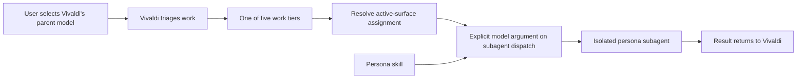

# 10x Squad Configurable Work-Tier Model Routing Implementation Plan

> **For Claude:** REQUIRED SUB-SKILL: Use superpowers:executing-plans to implement this plan task-by-task.

**Status:** Implemented model-routing baseline; runtime-setting policy superseded by [Work-Tier Runtime Settings Design](2026-07-13-work-tier-runtime-settings-design.md)
**Date:** 2026-07-13  
**Decision owner:** Nick  
**Target repository:** `/Users/ndmyers/Accrualify/10x-squad`

**Goal:** Replace the squad's hardcoded persona-by-model-tier guidance with a user-configured, exact model assignment for each of the five existing work-complexity tiers, managed through a new `10x-squad-configure-tiers` skill.

**Architecture:** The user manually selects Vivaldi's parent model. Vivaldi classifies the task, resolves one exact model identifier from the active harness's five-tier configuration, and supplies that identifier explicitly on every persona-subagent dispatch for that task. Persona skills remain model-agnostic. No generated tier workers or second model-tier taxonomy are introduced.

**Tech Stack:** Node.js 20+, CommonJS, dependency-free JSON configuration, GitHub Copilot custom agents/subagents, GitHub Copilot skills, `node:test`.

---

## Review request for Fable 5

Please return one of:

- **ACCEPT** — the design is mechanically enforceable as written.
- **ACCEPT WITH CHANGES** — list exact required changes and the failure they prevent.
- **REJECT** — identify the unsupported actuator or contradictory invariant.

Review the load-bearing mechanics, especially per-dispatch model selection, surface-native identifiers, actual-model observability, global-config readability, and local/BYOK provider boundaries. Do not reopen private-work-task benchmarking or cost optimization unless new evidence invalidates the stated product decision.

## Executive decision

Adopt a single configuration dimension:

| Work tier | Canonical key |
|---|---|
| Trivial | `trivial` |
| Lite | `lite` |
| Standard (Clear) | `standard_clear` |
| Standard (Ambiguous) | `standard_ambiguous` |
| Complex | `complex` |

Each active harness/surface has exactly one executable model identifier for each key. Every persona dispatched during a task uses the model assigned to that task's work tier. The persona still determines *how* the subagent behaves; it does not determine *which* model executes it.

The `default-all` path is a setup shortcut only. It asks for one model once, then writes the same explicit identifier into all five assignments. There is no persisted `default`, inheritance rule, or hidden fallback.

### Why this is the right seam

- Work-complexity tiering already exists and is understood by users.
- Vivaldi already owns classification and dispatch, so it also owns deterministic lookup.
- Model preferences change independently of persona instructions.
- A single mapping avoids five generated workers per persona and avoids a second meaning for “tier.”
- Quality is the governing objective. The configuration does not optimize for price or automatically demote work to cheaper models.

## Alternatives considered

| Approach | Decision | Reason |
|---|---|---|
| Keep model names in Vivaldi's Markdown table | Reject | Names rot, persona and capability concerns are coupled, and edits require prompt surgery. |
| Generate tier-specific worker agents | Reject | Multiplies artifacts, duplicates persona instructions, and is unnecessary where the parent can pass a model explicitly. |
| Use Copilot Auto or parent inheritance | Reject unconditionally | Banned by product decision: Auto is the opposite of user-owned static selection. Selecting an Auto parent is user error; the squad does not detect or compensate for it. |
| Add `frontier1` / `frontier2` / `standard` / `local` model tiers | Reject | Conflicts semantically with the existing five work tiers and adds a translation layer with no value. |
| Configure each persona independently | Reject | Granularity is not wanted; all personas for one task use the task's work-tier assignment. |
| Config-driven exact dispatch by work tier | **Adopt** | Smallest design with one classifying decision and one enforceable runtime lookup. |

## Architecture invariants

1. **Vivaldi's model is outside this configuration.** The user selects the strongest suitable parent model in the harness UI/CLI. Vivaldi's `.agent.md` keeps `model:` unset.
2. **The five work tiers are the only routing tiers.** No `frontier`, `standard-model`, `higher-tier`, economy, local, provider, or persona tier participates in runtime selection.
3. **Persona skills are model-agnostic.** Einstein, Peter, Linus, Cobalt, Sentinel, and Ralph contain behavior and output contracts only.
4. **One tested resolver owns precedence and validation.** Vivaldi invokes the installed resolver script; it does not reinterpret configuration rules from prose.
5. **One task tier resolves to one exact surface-native model identifier.** All subagents for that task receive it explicitly.
6. **A tier change triggers re-resolution.** Running subagents are not restarted; subsequent dispatches use the new tier's assignment.
7. **A user may override one dispatch.** The override is announced, applies once, and never mutates stored configuration.
8. **No silent fallback.** Missing configuration, invalid identifiers, policy rejection, provider mismatch, model substitution, or parent-cost ceiling fallback stops the pipeline.
9. **No credentials in routing configuration.** Provider endpoints and tokens stay in harness/provider configuration or environment variables.
10. **Discovery is advisory.** A model scan can populate choices but cannot edit assignments without explicit confirmation.
11. **Private workplace tasks are not a model leaderboard.** Public benchmarks, official release data, and user judgment inform configuration; repository tests validate squad conformance only.
12. **Copilot Auto is never used, at any level.** This is an unconditional product decision, not contingent on documented harness behavior. Selecting Auto as the parent model is user error; the squad does not detect or compensate for it. The executed-model confirmation in the runtime contract is the only backstop.



## Configuration contract

### Locations and precedence

The configuration is squad-wide, not persona-specific.

1. **One-dispatch user override** — transient and explicitly announced.
2. **Workspace configuration** — `<workspace>/.10x-squad/model-routing.json`.
3. **User-global configuration** — `$XDG_CONFIG_HOME/10x-squad/model-routing.json`, falling back to `~/.config/10x-squad/model-routing.json`.
4. **No assignment** — configuration error; invoke `10x-squad-configure-tiers`.

The override unit is one complete harness profile. If a workspace file defines the active harness, its five assignments replace that harness's global profile wholesale. There is no per-key merge in v1. The skill may preload the global values, let the user change one, and still save a complete workspace profile.

This deliberately avoids a generated “effective config” snapshot. If a surface cannot read the global file, that surface requires a workspace configuration. The compatibility spike must verify readability before the global scope is advertised for that surface.

Neither config location is installer-owned. Reinstalling the squad must preserve both.

### Proposed schema

```json
{
  "schema_version": 1,
  "updated_at": "2026-07-13T00:00:00.000Z",
  "harnesses": {
    "copilot-vscode": {
      "assignments": {
        "trivial": "GPT-5.4 (copilot)",
        "lite": "GPT-5.4 (copilot)",
        "standard_clear": "GPT-5.4 (copilot)",
        "standard_ambiguous": "GPT-5.4 (copilot)",
        "complex": "GPT-5.4 (copilot)"
      },
      "model_checks": {
        "GPT-5.4 (copilot)": {
          "display_name": "GPT-5.4",
          "status": "unverified",
          "method": "harness_catalog",
          "source": "harness",
          "checked_at": "2026-07-13T00:00:00.000Z"
        }
      }
    },
    "copilot-cli": {
      "assignments": {
        "trivial": "gpt-5.4",
        "lite": "gpt-5.4",
        "standard_clear": "gpt-5.4",
        "standard_ambiguous": "gpt-5.4",
        "complex": "gpt-5.4"
      },
      "model_checks": {
        "gpt-5.4": {
          "display_name": "GPT-5.4",
          "status": "verified",
          "method": "dispatch_smoke_test",
          "source": "harness",
          "checked_at": "2026-07-13T00:00:00.000Z"
        }
      }
    }
  }
}
```

The model names above illustrate shape only; they are not defaults and must not be copied into production configuration without current verification.

### Schema rules

- `schema_version` must be exactly `1`.
- A harness profile must contain all five assignment keys exactly once.
- Assignment values are exact executable identifiers for that surface, not friendly labels.
- `auto`, `inherit`, blank strings, unknown tier keys, `null`, and non-string assignments are invalid.
- `model_checks` is optional advisory metadata keyed by the exact assignment value. It is not a second routing source.
- Check status is `verified` or `unverified`.
- Catalog presence alone does not prove that a spawned subagent can execute the model. `verified` requires an explicit subagent capability signal or a successful, observable dispatch smoke test on that surface.
- A missing, malformed, or unused `model_checks` entry never invalidates the five executable assignments. Resolution reports the model as unverified when usable verification metadata is absent. V1 has no time-based expiry rule; `checked_at` is informational until an explicit refresh or dispatch result changes the status.
- Suggested sources are `harness`, `candidate_scan`, and `manual`.
- Free-text entries are preserved exactly and start as `unverified` unless the active harness verifies them.
- The validator uses a strict field allowlist and rejects unknown/credential-shaped fields such as `api_key`, `token`, or `secret`. It does not heuristically inspect opaque model-ID or label values for secret-like text.
- A local model is not a special routing tier. It is usable only when the active harness/provider exposes an exact addressable identifier. Provider endpoint and credential setup is out of band.
- VS Code and Copilot CLI identifiers must not be assumed interchangeable. Each surface has its own profile.

### Profile mutation and resolver contract

The configurator edits one harness profile at a time. Its proposal file contains only that profile's `assignments` and optional `model_checks`. Harness-aware upsert/remove operations load the containing config file, preserve every unrelated harness profile, update `updated_at`, validate the result, and replace the file atomically. Removal supports dry-run preview; removing the final workspace profile deletes `model-routing.json` and leaves the `.10x-squad` directory intact, revealing the global profile on the next resolve.

Vivaldi never parses precedence itself. In an installed workspace it runs:

```bash
node .github/skills/10x-squad-configure-tiers/scripts/model-tier-config.js resolve \
  --workspace-root "$PWD" \
  --harness <surface> \
  --tier <canonical-tier-key> \
  --json
```

Successful stdout is one JSON object and no prose:

```json
{
  "ok": true,
  "schema_version": 1,
  "scope": "workspace",
  "harness": "copilot-vscode",
  "tier": "standard_clear",
  "model": "surface-native-model-id",
  "check_status": "verified"
}
```

Exit codes are stable: `0` resolved; `2` missing/corrupt/incomplete configuration; `3` active harness profile missing; `4` invalid tier; `5` I/O or internal failure. Errors go to stderr as one actionable line. Tests cover both JSON shape and exit codes.

## `10x-squad-configure-tiers` skill UX

### Entry points

The skill runs when:

- the user invokes `/10x-squad-configure-tiers`;
- the user asks to view or change squad model assignments; or
- Vivaldi encounters missing/invalid routing configuration and offers the skill.

It does not run automatically during a healthy pipeline.

### Conversation flow

1. Detect the active harness/surface. If detection is uncertain, ask once; never guess an identifier namespace.
2. Resolve and display the current effective five-row mapping and its source.
3. Ask for scope: user-global or current workspace.
4. Offer actions:
   - Apply one model to all five work tiers.
   - Configure each work tier individually.
   - Review and validate the current mapping.
   - Remove the active workspace profile and reveal the global profile.
   - Refresh model suggestions.
5. For model selection, show sections in this order:
   - **Verified available in this harness**.
   - **Other current candidates** from an optional official/frontier scan, clearly marked unverified here.
   - **Exact free-text model identifier**.
   - **Keep current value**, when one exists.
6. Reuse models already entered so per-tier mode does not repeat discovery five times.
7. Show both the stored-file diff and the resulting effective five-row mapping.
8. Ask for confirmation.
9. Validate and write atomically.
10. Resolve the saved configuration again and report the effective mapping.

Use the harness's structured choice UI when available and numbered choices otherwise. Free text is always available. A failed or offline candidate scan must not block manual configuration.

### Default-all behavior

“Apply one model to all five work tiers” prompts for one exact model identifier and expands it into the five canonical keys before validation. The file never stores a `default_all` flag or fallback value.

### Free-text and local-model behavior

- Keep friendly display text separate from the exact executable identifier.
- Mark an unverified manual value visibly.
- Before substantive work, preflight an unverified value when the harness provides a harmless check.
- If only a dispatch can verify it, run a no-side-effect child probe first and compare requested versus executed model where observable.
- If the harness cannot address the identifier, changes provider unexpectedly, substitutes another model, or cannot make the execution identity auditable, stop with the surface, tier, configured ID, and reconfiguration command.
- A cloud Vivaldi dispatching one child through an unrelated local provider is unsupported until proved by a dedicated compatibility test.

## Vivaldi runtime contract

After TRIAGE and before the first subagent:

1. Detect the active harness profile.
2. Invoke the installed resolver command with the active surface and canonical work-tier key.
3. Treat any nonzero exit, malformed JSON, or declined/unexecutable resolver invocation as a hard configuration failure; never improvise a model when the resolver cannot run.
4. Use only the returned exact model identifier; do not duplicate file precedence or schema validation in prompt logic.
5. Announce: `Routing to Linus — Standard (Clear) → <exact-model-id> [copilot-vscode]`.
6. Invoke the persona subagent with:
   - the persona skill/instructions;
   - the context slice permitted by the visibility matrix; and
   - the exact model parameter.
7. Confirm the executed model when the surface reports it. Any mismatch hard-blocks the pipeline.

Every later persona dispatch for the same task uses the same work-tier assignment. If the task is reclassified, Vivaldi resolves again before the next dispatch.

The current parent instruction, “You do not write code,” must be scoped to the parent Vivaldi context. A generic child that inherits the custom agent must be allowed to execute its loaded persona duty, including Linus implementation. This must be covered by the compatibility spike and an operative prompt contract test.

### Failure message contract

Failures must include:

- active harness/surface;
- work tier and canonical key;
- requested model identifier, when resolution reached one; otherwise the literal `<unresolved>`;
- reason: missing, unverified, unavailable, policy-blocked, provider mismatch, cost-ceiling substitution, or observed-model mismatch;
- exact next action: invoke `/10x-squad-configure-tiers`, choose another identifier, or explicitly approve a one-dispatch parent-model override.

Vivaldi must never silently use Auto, inherit the parent, select a cheaper model, or substitute a “close” model.

## Current harness evidence and caveats

- VS Code documents explicit subagent model selection with this precedence: explicit `runSubagent` model, custom-agent `model`, then parent model. It also documents a ceiling: a requested subagent model above the parent's cost tier falls back to the parent. See [VS Code subagents](https://code.visualstudio.com/docs/agents/subagents).
- Copilot CLI `/fleet` supports different models for different subtasks, while default workers may use a low-cost model unless explicitly directed. See [GitHub Copilot CLI fleet](https://docs.github.com/en/copilot/concepts/agents/copilot-cli/fleet).
- Auto is banned by unconditional product decision (invariant 12); no documentation claim about Auto's inheritance mechanics is load-bearing for this rule. An explicitly selected parent is a hard prerequisite, and an Auto parent is user error.
- VS Code and CLI use different identifier forms; the schema intentionally separates their profiles.
- A user-selected “most capable” parent is a strong operational premise, but it does not mechanically prove the highest GitHub cost tier. The compatibility spike must confirm no ceiling fallback.
- Restricted Mode, enterprise model policy, retirement, provider consent, or changed availability can invalidate a previously verified assignment.

These are implementation constraints, not reasons to return to generated workers. A surface that cannot satisfy explicit and observable selection is marked unsupported until the user revisits that product decision.

## Non-goals for v1

- Generated tier workers or generated persona agents.
- Per-persona model assignments.
- A `frontier1` / `frontier2` / `standard` / `local` taxonomy.
- Automatic benchmark-based promotion or private-PR leaderboards.
- Cost, token-price, or premium-request optimization.
- Automatic provider setup, endpoint management, or credential storage.
- Cross-provider child dispatch unless the active harness proves it.
- Reasoning-effort configuration was a v1 non-goal. This historical restriction and its “highest supported” posture are superseded by the work-tier runtime-settings design; reasoning and context are now explicit-or-`auto` per-tier settings.
- Editing the work-tier classification rubric.

## Acceptance criteria

| ID | Criterion |
|---|---|
| AC1 | The installed squad contains a valid `10x-squad-configure-tiers` skill and all of its nested resources. |
| AC2 | Default-all writes exactly the five canonical assignments with one selected exact model ID. |
| AC3 | Individual mode supports five independent assignments and validates each. |
| AC4 | Vivaldi's parent model remains manually selected and unpinned in frontmatter. |
| AC5 | Vivaldi classifies work first, invokes the installed tested resolver, and passes its exact returned model on every subagent dispatch. |
| AC6 | Persona skills contain no model assignment policy. |
| AC7 | Workspace profiles replace global profiles per harness; no partial assignment merge occurs. |
| AC8 | Missing, corrupt, incomplete, unsupported, or rejected configuration fails loudly without Auto, inheritance, or model substitution. |
| AC9 | Free-text IDs remain available and visibly unverified until checked. |
| AC10 | No credentials are stored in model-routing files. |
| AC11 | Reinstall updates installer-owned assets and preserves both global and workspace user configuration. |
| AC12 | At least one real VS Code and one real Copilot CLI smoke test proves requested and executed subagent model identity, or the unproved surface is explicitly marked unsupported. |
| AC13 | Existing external operative Auto/private-work-task model policies are explicitly retired; deterministic squad conformance tests remain. |

---

## Implementation map

### Task 0: Prove the actuator before changing production prompts

**Files:**

- Create: `docs/model-routing-harness-spike.md`
- Inspect: `assets/agents/10x-squad.agent.md`

**Pre-registered evidence criteria (fixed before any probe runs; may not be relaxed mid-spike):**

- A surface passes only if the executed child model's *identity* is directly observable per dispatch — from harness UI, events, timeline, or terminal output. Cost, credits-tier, or price inference is insufficient on VS Code.
- On Copilot CLI, aggregate `/usage` per-model totals are insufficient unless the probe is isolated so single-dispatch attribution is unambiguous — and that counts as spike-time evidence only, not runtime observability. Record which of the two the surface actually provides.
- Vivaldi must be able to execute the resolver command unattended — no per-dispatch human approval. A surface that prompts for approval on every invocation fails the contract.

**Step 1: Record the supported surfaces and exact versions**

Record VS Code/Copilot extension and Copilot CLI versions, parent model selection, workspace trust state, enterprise policy, and the exact model handles exposed by each surface.

**Step 2: Run a harmless VS Code subagent probe**

From Vivaldi with an explicitly selected parent, spawn an isolated child with a different valid model and a no-side-effect prompt such as “return `MODEL_ROUTE_OK` and make no edits.” Confirm:

- Vivaldi can supply an explicit model parameter.
- The child executes with the requested model.
- The persona skill can load without inheriting Vivaldi's parent-only prohibition on implementation.
- Requested and actual model identity are observable.

**Step 3: Test the VS Code ceiling and failure path**

Request a model above the parent's cost tier and an invalid identifier. Record whether the surface errors or substitutes. Any substitution must be detectable; otherwise exact routing is unsupported on that path.

**Step 4: Repeat in Copilot CLI**

Use the task/subagent mechanism with an explicit CLI model slug. Capture the child model from available events, timeline, usage, or terminal output, judged against the pre-registered evidence criteria. Verify with an explicitly selected parent only; do not spend spike time characterizing Auto behavior — Auto is banned by invariant 12 and selecting it is user error.

**Step 5: Probe unattended resolver execution**

The resolver script does not exist yet; use a harmless stand-in such as `node -e "console.log(JSON.stringify({ok:true}))"`. From Vivaldi's context on each surface, verify the command executes without per-call human approval, and record what happens when the tool invocation is declined or unavailable. Declined or unexecutable invocation must map to the runtime contract's hard configuration failure, never to Vivaldi improvising a model.

**Step 6: Probe global-config readability**

Verify whether each supported runtime can read the chosen user-global path. If not, document workspace configuration as mandatory for that surface.

**Step 7: Probe one local/BYOK case only when already configured**

If the active harness already has an addressable local/BYOK model, verify it separately. Otherwise record it as untested; absence of local-provider setup does not block the cloud-only v1. Treat cross-provider child dispatch as unsupported unless the actual child model proves otherwise.

**Step 8: Gate**

If explicit per-dispatch selection is unavailable, executed-model identity cannot be observed per the pre-registered evidence criteria, or the resolver cannot run unattended, stop. Do not implement generated workers as an unapproved fallback.

**Step 9: Commit evidence**

```bash
git add docs/model-routing-harness-spike.md
git commit -m "docs: verify explicit subagent model routing"
```

### Task 1: Scaffold the skill and write failing configuration tests

**Files:**

- Create: `assets/skills/10x-squad-configure-tiers/SKILL.md`
- Create: `assets/skills/10x-squad-configure-tiers/scripts/model-tier-config.js`
- Create: `assets/skills/10x-squad-configure-tiers/references/config-format.md`
- Create: `assets/skills/10x-squad-configure-tiers/agents/openai.yaml`
- Create: `test/model-tier-config.test.js`

**Step 1: Scaffold with the skill creator**

```bash
python3 /Users/ndmyers/.codex/skills/.system/skill-creator/scripts/init_skill.py \
  10x-squad-configure-tiers \
  --path assets/skills \
  --resources scripts,references \
  --interface display_name="Configure 10x Squad Work Tiers" \
  --interface short_description="Assign exact subagent models to five work tiers" \
  --interface default_prompt='Use $10x-squad-configure-tiers to configure one model for all work tiers or assign each tier individually.'
```

Remove placeholder files that are not part of the design. Keep `SKILL.md` frontmatter limited to `name` and `description`; `agents/openai.yaml` holds UI metadata.

**Step 2: Write failing unit tests**

Test pure functions and the CLI for:

- default-all expansion produces exactly five explicit assignments;
- per-tier mode requires exactly all five canonical keys;
- VS Code and CLI profiles may use different identifiers;
- free-text values are preserved byte-for-byte and marked unverified when the proposal supplies no current successful check;
- `auto`, `inherit`, blank values, unknown tiers, unknown fields, and unsupported schema versions fail;
- missing, malformed, or unused advisory check metadata does not block a complete assignment map and yields an unverified warning where appropriate; no time-based expiry is inferred;
- unknown credential-shaped fields fail, while opaque assignment/label values are not heuristically scanned;
- workspace profile replaces the matching global harness profile wholesale;
- deleting the workspace profile reveals the global profile;
- a workspace file without the active harness falls through to the global profile;
- upserting or removing one harness profile preserves every unrelated harness profile byte-for-byte at the data level;
- remove dry-run previews the stored/effective change without writing, and removing the last workspace profile deletes only the config file;
- a missing effective profile returns an actionable error;
- harness mismatch never reuses another surface's identifiers;
- resolver stdout and exit codes match the documented runtime contract;
- dry-run writes nothing;
- invalid input leaves the prior file unchanged;
- global and workspace path resolution is deterministic under injected temp home/config directories.

**Step 3: Run the focused test and confirm failure**

```bash
node --test test/model-tier-config.test.js
```

Expected: failure because the configuration module/behavior is not implemented.

### Task 2: Implement the deterministic configuration engine

**Files:**

- Modify: `assets/skills/10x-squad-configure-tiers/scripts/model-tier-config.js`
- Modify: `assets/skills/10x-squad-configure-tiers/references/config-format.md`
- Test: `test/model-tier-config.test.js`

**Step 1: Implement dependency-free commands**

```text
validate-profile --input <profile.json> --harness <surface>
diff-profile     --input <profile.json> --scope <global|workspace> --workspace-root <path> --harness <surface>
upsert-profile   --input <profile.json> --scope <global|workspace> --workspace-root <path> --harness <surface>
remove-profile   --scope workspace --workspace-root <path> --harness <surface> [--dry-run]
resolve          --workspace-root <path> --harness <surface> --tier <tier-key> [--json]
```

The first three commands consume one profile, not a whole config file. Upsert/remove must preserve unrelated harness profiles. Export the underlying pure functions so `node:test` can exercise validation and resolution without subprocesses, while subprocess tests lock the resolver's JSON/exit-code contract used by Vivaldi.

**Step 2: Make writes atomic**

Create the parent directory, write a uniquely named temporary file in the same directory, validate the serialized result, then rename it over the target. Clean up the temporary file on failure. Never browse or shell out from this script.

**Step 3: Keep discovery outside the engine**

The engine accepts exact proposals. The conversational skill owns model lookup, choice presentation, and user confirmation.

**Step 4: Run focused tests**

```bash
node --test test/model-tier-config.test.js
```

Expected: all configuration tests pass.

**Step 5: Commit**

```bash
git add assets/skills/10x-squad-configure-tiers test/model-tier-config.test.js
git commit -m "feat: add work-tier model configuration engine"
```

### Task 3: Implement and forward-test the conversational skill

**Files:**

- Modify: `assets/skills/10x-squad-configure-tiers/SKILL.md`
- Modify: `assets/skills/10x-squad-configure-tiers/references/config-format.md`
- Modify: `assets/skills/10x-squad-configure-tiers/agents/openai.yaml`
- Create: `test/configure-tiers-skill.test.js`

**Step 1: Write a small failing package-contract test**

Assert that the skill:

- has valid `name` and `description` frontmatter;
- references its bundled script and config-format reference by valid relative paths;
- identifies both default-all and individual flows and all five canonical keys;
- invokes the harness-aware profile commands rather than editing configuration directly.

Do not turn conversational wording into a brittle snapshot test. Cover picker ordering, confirmation, offline/free-text behavior, and fail-loud explanations through forward tests.

**Step 2: Write the skill instructions**

Keep `SKILL.md` concise and put schema details in `references/config-format.md`. Discovery must prefer current official harness/provider sources and may summarize public benchmark evidence, but must label dates and sources and never auto-select a model.

**Step 3: Validate the skill package**

```bash
python3 /Users/ndmyers/.codex/skills/.system/skill-creator/scripts/quick_validate.py \
  assets/skills/10x-squad-configure-tiers
node --test test/configure-tiers-skill.test.js
```

Expected: both commands pass.

**Step 4: Forward-test in disposable workspaces**

Use fresh agent contexts to run:

1. default-all with a verified model;
2. five distinct selections;
3. offline scan failure plus free-text entry;
4. review-only with no write;
5. workspace override removal.

The forward-test agent receives only the skill and scenario, not the intended answer. Capture friction or ambiguity and revise once.

**Step 5: Commit**

```bash
git add assets/skills/10x-squad-configure-tiers test/configure-tiers-skill.test.js
git commit -m "feat: add tier configuration skill workflow"
```

### Task 4: Make the installer copy complete skill packages

**Files:**

- Modify: `test/installer.test.js`
- Modify: `lib/installer.js`
- Modify: `package.json`

**Step 1: Extend installer tests first**

Add `10x-squad-configure-tiers` to the expected skills and explicitly require its `SKILL.md`, script, reference, and UI metadata. Add tests that:

- every nested skill resource is copied byte-for-byte;
- asset enumeration is deterministic;
- rerunning install replaces installer-owned skill resources;
- rerunning install preserves `.10x-squad/model-routing.json` and unrelated customizations.

**Step 2: Run and confirm failure**

```bash
node --test test/installer.test.js
```

Expected: missing skill/nested-resource assertions fail.

**Step 3: Implement recursive deterministic skill enumeration**

Add the skill name to `skillNames`. Replace the `SKILL.md`-only mapping with a sorted recursive walk of each listed skill directory, while retaining file-level `assets` exports and current idempotent copy behavior.

**Step 4: Enable complete test discovery**

Change `package.json` to:

```json
"test": "node --test"
```

**Step 5: Run tests**

```bash
npm test
```

Expected: all tests pass.

**Step 6: Commit**

```bash
git add lib/installer.js test/installer.test.js package.json
git commit -m "feat: install complete 10x Squad skill packages"
```

### Task 5: Replace Vivaldi's obsolete model-routing doctrine

**Files:**

- Create: `test/agent-model-routing.test.js`
- Modify: `assets/agents/10x-squad.agent.md`

**Step 1: Write the failing machine-contract test**

Extract Vivaldi's operative model-routing section and assert:

- Vivaldi frontmatter has no `model:` pin;
- the obsolete persona-by-model routing table is absent;
- the exact installed resolver path, `resolve`, required flags, and JSON-result handling are present;
- the resolved `model` value is supplied explicitly at subagent dispatch;
- nonzero resolver status and requested/executed model mismatch hard-block;
- Vivaldi's no-code rule is scoped to the parent context.

Do not snapshot editorial phrasing or broad lists of prohibited words. Forward tests and the real dispatch spike own behavioral wording.

**Step 2: Run and confirm failure**

```bash
node --test test/agent-model-routing.test.js
```

Expected: assertions fail against the current persona-by-tier table.

**Step 3: Rewrite the operative section**

Replace the current `## Model Routing` table with the runtime contract in this document. Require Vivaldi to call the installed resolver command and consume only its stable JSON result. Update routing announcements elsewhere from “model tier” to “resolved model.” Add re-resolution to the existing work-tier upgrade path.

Scope the opening instruction as:

> Vivaldi's parent context does not implement code. Spawned subagents follow their loaded persona skill; Linus may implement within its isolated child context.

Do not add model names to Vivaldi or persona skill files.

**Step 4: Run tests**

```bash
node --test test/agent-model-routing.test.js
npm test
```

Expected: all tests pass.

**Step 5: Commit**

```bash
git add assets/agents/10x-squad.agent.md test/agent-model-routing.test.js
git commit -m "refactor: route subagent models by configured work tier"
```

### Task 6: Document the operating model and retire the old eval gate

**Files:**

- Create: `docs/plans/2026-07-13-configurable-work-tier-model-routing.md`
- Create: `docs/model-tier-configuration.md`
- Modify: `README.md`
- Modify: `docs/model-routing-review-triage.md`
- Modify after repo acceptance, in the same migration: `~/.claude/10x-squad/MODEL-ROUTING.md`
- Modify after repo acceptance, in the same migration: `~/.claude/10x-squad/EVAL-PLAN.md`

**Step 1: Land this accepted plan**

Copy this reviewed packet to `docs/plans/2026-07-13-configurable-work-tier-model-routing.md`.

**Step 2: Add the concise operator documentation**

Document:

- invocation and both configuration flows;
- exact scope/precedence semantics;
- per-surface identifiers;
- free-text and local-provider boundaries;
- failure and one-dispatch override behavior;
- examples labeled as illustrative, never defaults;
- how to refresh assignments when new models ship.

**Step 3: Update the README**

Describe seven skills, nested skill resources, config locations, config preservation, the manual Vivaldi-parent premise, and `npm test`.

**Step 4: Preserve history and retire contradictory operative policy**

Add a short supersession note to `docs/model-routing-review-triage.md`. Do not rewrite the historical review packet.

In the same migration, replace the operative content of `~/.claude/10x-squad/MODEL-ROUTING.md` with the accepted five-work-tier configuration policy and mark `~/.claude/10x-squad/EVAL-PLAN.md` historical/superseded at its top. It must no longer instruct the squad to use Auto-first routing, private PR promotion gates, or the removed model-tier vocabulary. These external files are not part of the repository commit, so record their updated paths and verification in the implementation report rather than pretending `git add` covers them.

The replacement eval posture is:

- public benchmark and official release evidence helps the user choose candidates;
- one harmless target-harness dispatch validates reachability and identity;
- deterministic tests validate schema, precedence, dispatch instructions, installation, and fail-loud behavior;
- professional PRs are not a recurring model-ranking suite.

Verify the operative external documents explicitly:

```bash
rg -n "Auto-first|private PR|manual-tier|Higher-tier|frontier1|frontier2" \
  ~/.claude/10x-squad/MODEL-ROUTING.md \
  ~/.claude/10x-squad/EVAL-PLAN.md
```

Expected: no active instruction using those policies; historical mentions are clearly inside a superseded notice.

**Step 5: Commit**

```bash
git add README.md \
  docs/plans/2026-07-13-configurable-work-tier-model-routing.md \
  docs/model-tier-configuration.md \
  docs/model-routing-review-triage.md
git commit -m "docs: adopt configurable work-tier model routing"
```

### Task 7: End-to-end verification and review

**Files:**

- Verify all changed files.
- Do not create unrelated changes.

**Step 1: Run deterministic verification**

```bash
npm test
python3 /Users/ndmyers/.codex/skills/.system/skill-creator/scripts/quick_validate.py \
  assets/skills/10x-squad-configure-tiers
```

Expected: zero failures.

**Step 2: Install into a disposable workspace**

```bash
tmpdir="$(mktemp -d)"
mkdir -p "$tmpdir/.10x-squad"
printf '%s\n' '{"sentinel":"preserve-me"}' > "$tmpdir/.10x-squad/model-routing.json"
before="$(shasum -a 256 "$tmpdir/.10x-squad/model-routing.json")"
node bin/10x-squad.js install --directory "$tmpdir"
test "$(shasum -a 256 "$tmpdir/.10x-squad/model-routing.json")" = "$before"
node bin/10x-squad.js install --directory "$tmpdir"
test "$(shasum -a 256 "$tmpdir/.10x-squad/model-routing.json")" = "$before"
```

Before installation, create a sentinel `.10x-squad/model-routing.json` in the disposable workspace. Install once, verify it is unchanged, install a second time, and verify it is still unchanged. Also verify installed assets match source and nested resources are present.

**Step 3: Exercise both configuration modes**

- Default-all resolves all five keys to the chosen surface-native identifier.
- Individual mode resolves five selections exactly.
- Invalid/free-text failure paths produce actionable messages and preserve the previous file.

**Step 4: Repeat the real harness dispatch proof**

Run one verified work-tier dispatch on each claimed supported surface. Capture requested and actual child model. Run one invalid identifier and confirm a hard stop.

**Step 5: Request independent code and prompt review**

Review for config correctness, atomic writes, secret rejection, path safety, installer preservation, prompt enforceability, and accidental reintroduction of persona/model coupling.

**Step 6: Final repository check**

```bash
git status --short
git log --oneline -7
```

Expected: only intended changes, all commits present, no generated temp/config files committed accidentally.

## Fable 5 review checklist

Please answer each item explicitly:

1. Can Vivaldi's custom-agent context pass an exact per-dispatch model on every claimed VS Code and Copilot CLI path?
2. Can requested and executed child model identity be compared, including invalid-ID and cost-ceiling cases?
3. Does manually selecting the strongest Vivaldi model reliably avoid the VS Code cost-tier ceiling, or is an additional preflight required?
4. Are separate `copilot-vscode` and `copilot-cli` identifier profiles sufficient, or do more surface keys need to be distinguished?
5. Can each claimed surface read the user-global config path? If not, is requiring a workspace profile preferable to a generated projection?
6. Does a complete workspace profile replacement materially reduce brittleness versus partial key merging?
7. Is parent-only scoping of Vivaldi's “do not write code” sufficient for an inherited generic subagent loading Linus, or does dispatch need another explicit instruction?
8. Should an unverified free-text ID be allowed a harmless verification dispatch, or must it be configured through the harness first?
9. Is local/BYOK routing correctly limited to models addressable through the active provider?
10. Are `auto` and `inherit` correctly rejected for a static exact-routing contract?
11. Are there any remaining model names or model-tier concepts in operative persona instructions after migration?
12. Does the plan fully retire private professional tasks as a model-ranking gate while preserving squad-conformance testing?

## Recommendation

Proceed after the Task 0 compatibility gate. There are no product-design qualms with the five-work-tier configuration itself. The two engineering caveats are explicit and testable:

1. A model label is not executable until resolved to the exact active-surface identifier.
2. Exact routing is only enforceable on a surface where Vivaldi can pass the identifier and detect rejection or substitution.

Neither caveat warrants generated workers or a second tier taxonomy. It warrants a small compatibility gate and fail-loud behavior.
