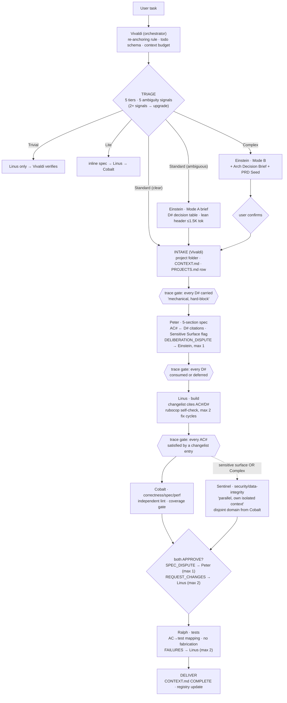
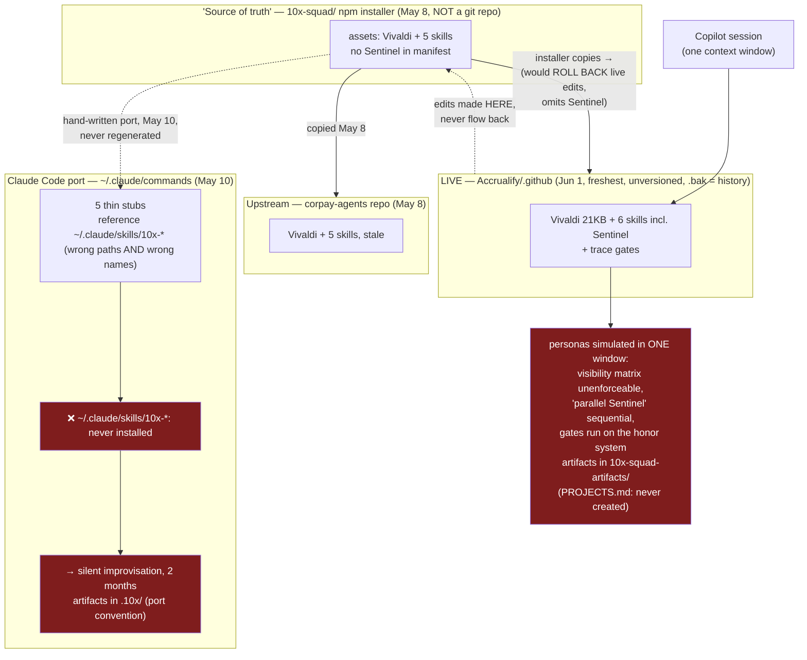
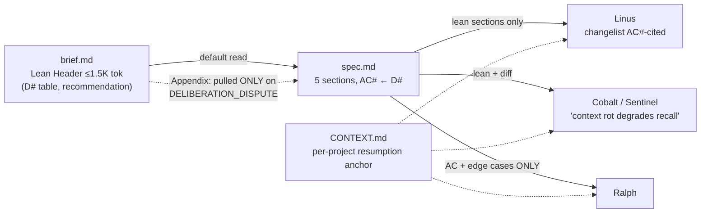
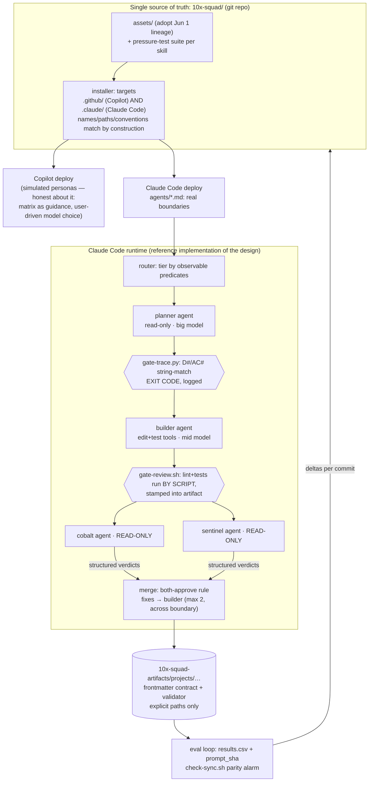
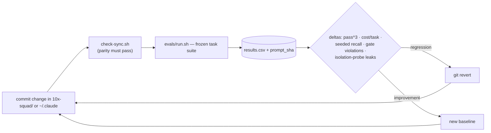

# 10x-Squad — Architecture: Designed vs. Deployed vs. Target (v2, corrected)

Diagrams are Mermaid — GitHub and VS Code (with Mermaid preview) render them natively.
Evidence for every claim is cited in [REVIEW.md](REVIEW.md). v1 of this file diagrammed the Claude-side stubs as if they were the system; this version diagrams the real thing.

---

## 1. The pipeline as designed (live Copilot lineage, Jun 1)

This is a genuinely advanced design: tiered routing with observable predicates, a decision-traceability chain with hard-block gates, disjoint dual review, bounded dispute channels, and context contracts (visibility matrix + lean-header artifact convention). The critique is **not** the design — it's that the boxes marked `{{…}}` and the words "isolated," "parallel," "mechanical," and "hard-block" have no runtime mechanism behind them on either harness.

---

## 2. What is actually deployed (the split brain)

**First measurement (2026-07-12), `evals/check-sync.sh`: 14 parity failures** — 6/6 skills drifted from installer assets and upstream, live Vivaldi ahead of its own source, Sentinel absent from the installer manifest, 6 dangling references in the Claude port.

The inversion to internalize: **the design assumes isolation and parallelism its primary harness (Copilot, one-window custom agents) cannot mechanically provide — while the harness that provides both natively (Claude Code: subagents, tool scoping, model routing, parallel dispatch) runs a stale stub port that uses none of it.**

---

## 3. Context flow (the part the design gets right — keep it)

Tiered reads, pointer-based cross-references, appendix-on-dispute, per-consumer slicing — this is textbook context engineering. It only *works* if each consumer is a separate invocation whose input you control (see §4); inside one window it's aspiration.

---

## 4. Target architecture (v2)

| Rule | Replaces | Finding |
|---|---|---|
| Edits flow source → deploy only; parity checked by script | live-copy editing, `.bak` versioning, rollback-trap installer | F7 |
| Trace gates and review gates are programs with exit codes and logs | "mechanical… hard-block" as prose | F4 |
| Claude agents = the visibility matrix made real (dispatch payload = the matrix row) | in-window persona simulation | F2 |
| Model/effort routing in agent frontmatter (enforceable layer); tier labels, not pinned model names | advisory prose table with rotting pins | F5 |
| One artifact convention + frontmatter validator + explicit addressing | `.10x/` vs `10x-squad-artifacts/`, "latest" fallback | F6 |
| Every run emits metrics stamped with prompt SHA | nothing | F3 |
| Skills shipped with pressure-test regression suites | untested wording | F8 |

---

## 5. The improvement loop (unchanged, now with the parity alarm)

Current state: parity **fails (14)** — which is the correct first reading. Details: [EVAL-PLAN.md](EVAL-PLAN.md).
